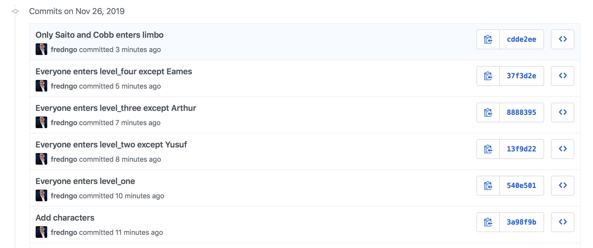

# Assignment: Inception

In this assignment, you'll practice:

* Creating folders/directories on the command line
* Creating files on the command line
* Deleting, renaming, and moving directories or files
* Finding what files your current directory contains, with `ls`
* Finding what your current working directory is, with `pwd`
* Creating a remote repository on Github
* Cloning a remote repository onto your computer locally
* Adding and committing files and directories with Git
* Pushing changes to Github

---

# Inception

This assignment will give you some practice with Git, Github, and the command line, by recreating the story of [Inception](http://www.imdb.com/title/tt1375666/?ref_=fn_al_tt_1).

You should also get a sense of what Git is, how it differs from GitHub, and how to use each of these tools.

* For Git, this means working with files locally with `git add`, `git commit`, and `git status`
* For GitHub, this means how to create a remote repository, cloning the repository locally, and pushing changes from your local repository to Github

Instead of using dreams and characters, we will be using files and directories. Each directory will represent a level and each file will represent a character.

As you go down each level (directory), one character (file) will be left behind and you will make a commit.

The 7 characters from the movie are:

* Ariadne
* Arthur
* Cobb
* Eames
* Robert Fischer Jr.
* Saito
* Yusuf

[Here's an infographic depicting the different dream levels and who goes where](assets/inception_infographic.jpg)

## Setting Up

1. Create a repository on GitHub, called `inception-assignment` or something similar
2. Open your Terminal and navigate to the folder for all of your development work with:

   ```bash
   cd $DEV
   ```

3. **Clone** your assignment repo onto your computer.

   **Protip:** Replace `<your github username>` with your actual github username

   ```bash
   git clone https://git.generalassemb.ly/<your github username>/inception-assignment.git
   ```

4. `cd` into the project directory

Have fun and feel free to discuss tips & tricks on our Slack discussion channel!

## Assignment Steps

**You must commit your changes after each step, otherwise you won't be taking snapshots in time!**

1. Create text files, one for each character listed above (Ariadne, Arthur, Cobb, etc.,)
1. Make a commit to record this chapter of the story.
1. Create the first directory called `level_one` and move all your characters into it
1. Make another commit!
1. Create the next directory, `level_two` and move all but one character down into level_two
1. Keep going for at least 2 more levels (`level_three`, `level_four` or even `limbo`!), committing each step of the way.
1. When you are finished, push your code to GitHub

At the end of the assignment you should have a repository on your GitHub that looks similar to [the solution](https://git.generalassemb.ly/PYTHR-Library/hw-01-inception-solution). Take note of the commits.



# Tips and Tricks

## Subdirectories

When you stage your files from within a subdirectory, you will need to use the `--all` flag instead of `git add .`:

```bash
git add --all
```

## Empty Directories

Github only tracks files and not directories. You won't be able to commit a new directory unless there's at least one file in it! See [Git FAQ: Empty directories](https://git.wiki.kernel.org/index.php/GitFaq#Can_I_add_empty_directories.3F) for more details.

## Help on Command-Line Commands

If you want more information about a command-line command you can type:

```bash
man <the name of the command>
```

To quit the help screen type `q`.

## Undoing a Commit

You might also want to go back to the previous commit. To do this type:

```bash
git reset --hard HEAD^
```

If you want to know the differences between `--hard`, `--soft`, and `--mixed`, check [this StackOverflow question](http://stackoverflow.com/questions/3528245/whats-the-difference-between-git-reset-mixed-soft-and-hard) out.

## Important Git Commands Cheatsheet

### Local Repository Workflow

* Shows status of files

   ```bash
   git status
   ```

* Stages changes to all files (including deleted files)

   ```bash
   git add --all
   ```

* Creates a new commit (a snapshot in time) with associated message

   ```bash
   git commit -m "<message>"
   ```
   
* Shows history of commits

   ```bash
   git log
   ```

### Remote Repository Workflow

* Copies a remote repo to your computer

   ```bash
   git clone <server url>
   ```

* Pulls changes on the remote repo to your local repo

   ```bash
   git pull
   ```

* Pushes local repo to remote repo

   ```bash
   git push origin master
   ```

---

# Submitting

To submit this assignment:

1. Go to the [assignment's main repo](../..)
1. Click the **Issues** tab
1. Click the **New Issue** button
1. In the Title field, fill in your name
1. In the comment field, copy and paste the URL to *your* assignment repo
1. Click **Submit new issue** and you're done!

---

# The Dream is Real


If you haven't watched Inception yet, maybe give it a shot, it's pretty good!
